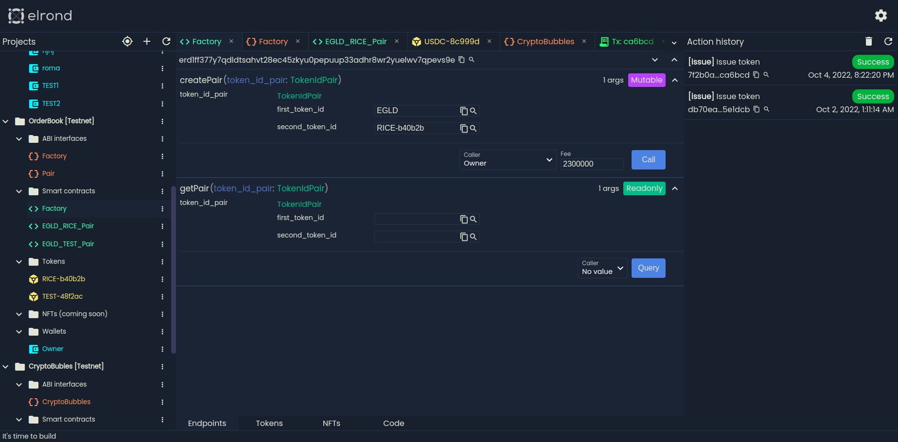

# Elrond SC [MVP develop]

The tool for easy interaction with smart contacts and ESTD/NFT/SFT token management on [Elrond network](https://github.com/ElrondNetwork) :heart:.

**DISCLAIMER:**

**PLEASE NOTE:THIS PROJECT ARE INCOMPLETE AND MIGHT HAVE SOME BUGS, PLEASE DO NOT USE IT FOR MAINNET.**

## Development server

Run `ng serve` for a dev server. Navigate to `http://localhost:4200/`.
## Build

Run `ng build` to build the project. The build artifacts will be stored in the `dist/` directory.
